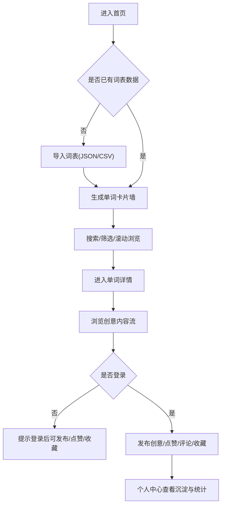

## 1. 产品概述
一个面向英语学习者的“单词创意记忆社区”：主页是一面由（用户导入的）词表构成的单词卡片墙；点开任意单词，浏览/发布创意联想、记忆法与例句，并通过点赞与收藏形成个人记忆体系。
- 解决问题：背单词枯燥、难以长期坚持；缺少高质量的“联想记忆”素材与整理方式
- 目标用户：备考人群（雅思/托福/考研）、英语自学者、词汇达人/内容贡献者
- 产品价值：把“词表”变成可浏览、可贡献、可沉淀的知识社区，提高记忆效率与学习粘性

## 2. 核心功能

### 2.1 用户角色
| 角色 | 注册方式 | 核心权限 |
|------|----------|----------|
| 游客 | 无 | 浏览单词卡片与创意内容、使用搜索筛选 |
| 登录用户 | 邮箱注册/登录 | 发布/编辑/删除自己的创意内容；点赞/收藏；维护个人词库；个人主页 |
| 管理员（可选） | 后台创建 | 内容管理（违规内容下架）、词表导入管理（可选） |

### 2.2 功能模块
1. **首页（单词卡片墙）**：词表导入提示、全局搜索、筛选与排序、无限滚动/虚拟列表、单词卡片交互（收藏状态、热度、已学标记）
2. **单词详情页**：单词信息（音标/发音/词性/释义/例句，可先用占位字段）、创意记忆流（按热度/最新）、发布创意、评论/回复、点赞/收藏、相似词/词根关联（可先用规则/占位）
3. **发布与编辑**：发布创意（标题、记忆法、图像联想描述、例句、标签）、草稿自动保存、富文本的轻量支持（Markdown）
4. **个人中心**：我的收藏/已学/发布、进度统计、连续学习打卡（可选）、导出个人词库（JSON）
5. **认证与账户**：注册/登录、退出、找回密码（可选）

### 2.3 页面详情
| 页面名称 | 模块名称 | 功能描述 |
|---------|----------|----------|
| 首页 | 顶部导航 | Logo、搜索框、筛选（词频/首字母/标签）、登录入口、个人入口 |
| 首页 | 词表导入入口 | 首次访问提示导入词表（JSON/CSV），并说明版权与来源要求 |
| 首页 | 单词卡片墙 | 卡片网格/瀑布流；hover 显示简要释义与热度；支持收藏、已学标记；点击进入详情 |
| 首页 | 性能策略 | 虚拟列表/按段加载；骨架屏；本地缓存；搜索防抖 |
| 单词详情 | 单词信息头 | 单词、音标、发音按钮、释义摘要、标签、收藏/已学按钮 |
| 单词详情 | 创意内容流 | 支持排序（热度/最新）；每条内容含作者、发布时间、标签、点赞、评论数 |
| 单词详情 | 发布创意 | 登录校验；Markdown 编辑；预览；草稿恢复；提交后刷新列表 |
| 单词详情 | 评论系统 | 一级评论 + 回复；基本反垃圾（频率限制/字数限制） |
| 发布/编辑 | 编辑器 | 标题、内容、标签、例句；自动保存草稿；提交与取消 |
| 个人中心 | 我的词库 | 收藏/已学列表；可按标签/字母筛选；导出 |
| 个人中心 | 统计面板 | 学习天数、已学数量、收藏数量、发布数量、热度排行（可选） |
| 认证 | 登录/注册 | 邮箱+密码；表单校验；错误提示；成功后返回来源页 |

## 3. 核心流程

### 3.1 主要用户流程（文字）
1. 用户首次进入首页 → 看到“导入词表”提示 → 上传 JSON/CSV → 生成单词卡片墙
2. 用户在首页搜索/筛选 → 点开单词 → 浏览创意记忆内容 → 收藏/标记已学
3. 用户登录 → 在单词详情发布创意 → 其他用户点赞/评论 → 内容按热度沉淀
4. 用户在个人中心查看已学与收藏 → 导出个人词库 → 持续复习

### 3.2 流程图（Mermaid）

## 4. 用户界面设计

### 4.1 设计风格
- 视觉概念：编辑部式“词典/索引卡”质感 + 轻微颗粒噪点与纸张纹理；强调可读性与密度控制
- 主色：深墨黑/纸张米白；强调色使用高饱和荧光绿或信号橙用于状态与交互
- 字体：标题使用有性格的衬线展示字体（用于“词典”氛围）；正文使用高可读无衬线；中英文搭配要统一（具体选型在技术文档中落地）
- 按钮与组件：细边框、轻微浮雕阴影、按压反馈；卡片 hover “抬起+高亮描边”
- 布局：桌面端优先；顶部固定导航；主内容为高密度卡片网格；详情页左右分栏（信息头 + 内容流）
- 图标风格：极简线性图标；状态图标（收藏/已学）使用强调色填充

### 4.2 页面设计概览
| 页面名称 | 模块名称 | UI 元素 |
|---------|----------|--------|
| 首页 | 单词卡片墙 | 多列自适应网格；卡片包含单词、简要释义/标签、热度点；hover 抬升与描边；加载骨架屏 |
| 单词详情 | 单词信息头 | 大号单词排版；音标与发音按钮；收藏/已学作为强交互；背景使用轻纹理 |
| 单词详情 | 创意内容流 | 类“贴文”卡片；作者信息淡化；点赞动画与计数；排序切换有过渡 |
| 个人中心 | 统计面板 | 简洁数据卡片 + 进度条；导出按钮强调色 |

### 4.3 响应式
- 桌面端优先：≥ 1024px 为核心体验
- 移动端适配：单列卡片墙 + 底部抽屉式筛选；详情页改为上下布局
- 触控优化：可点区域 ≥ 44px；滚动性能优先（虚拟列表）

## 5. 数据与合规说明
- 词表数据：不在仓库内直接内置受版权保护的牛津词表；产品提供“用户导入词表”的能力，并在导入处提示用户确保拥有合法使用权
- 内容治理：基础举报入口（可选）、敏感词过滤（可选）、删除/屏蔽能力（管理员可选）
