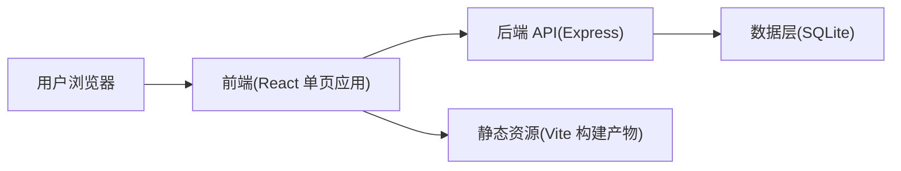
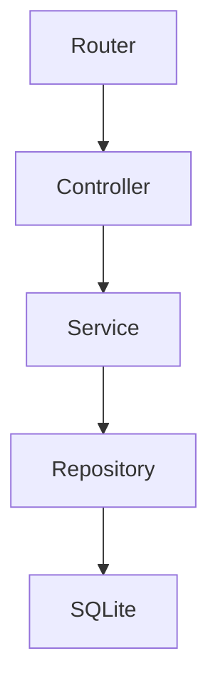
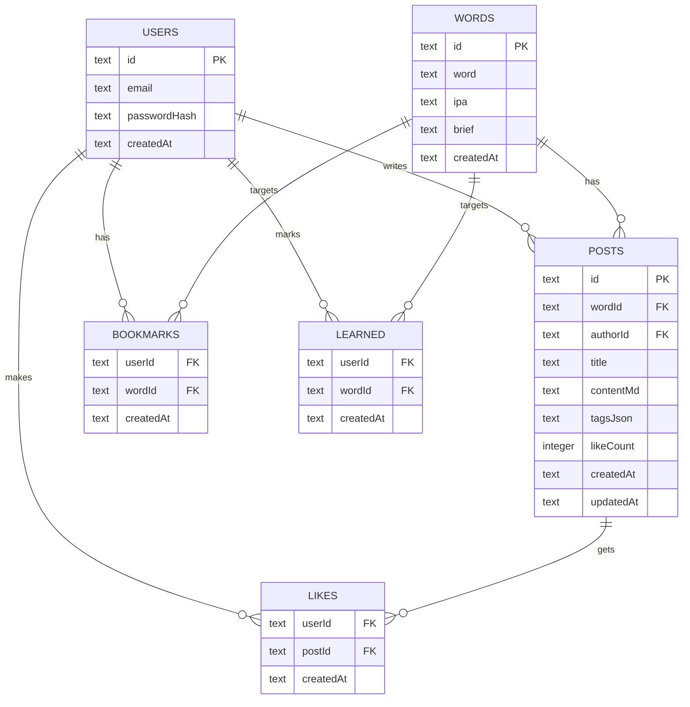

## 1. 架构设计



设计取舍：
- 前端负责高性能“单词卡片墙”与交互体验（搜索、筛选、虚拟列表、动画）
- 后端负责用户、内容、点赞/收藏等持久化与权限校验
- 数据库选择 SQLite 作为 MVP 数据存储，便于本地/轻部署；后续可平滑迁移到 PostgreSQL

## 2. 技术选型说明
- 前端：React@18 + TypeScript + Vite
- 样式：Tailwind CSS（结合 CSS 变量实现主题化纹理与强调色）
- 状态与数据请求：React Query（若后续确认未引入，则改为自建 hooks + fetch）
- 路由：React Router（若后续确认未引入，则使用轻量替代或自建路由）
- 后端：Node.js + Express
- 数据库：SQLite
- 鉴权：基于 Cookie 的会话（MVP）或 JWT（可选其一，开发阶段先做 Cookie Session 更贴近 Web）
- 词表导入：前端上传 JSON/CSV → 后端解析入库（或写入本地存储，取决于是否启用后端）

约束与注意：
- 不直接内置受版权保护的牛津词表；通过导入机制让用户提供词表数据
- 超大词量的首页渲染必须使用虚拟列表与增量加载，避免一次性渲染全部卡片

## 3. 路由定义（前端）
| 路由 | 用途 |
|------|------|
| / | 首页：单词卡片墙（搜索/筛选/导入） |
| /w/:word | 单词详情页：创意内容流与发布 |
| /new | 发布创意（可选：也可在详情页内完成） |
| /me | 个人中心：收藏/已学/发布/统计 |
| /auth | 登录/注册 |

## 4. API 定义（后端）

### 4.1 类型定义（TypeScript 伪代码）
```ts
export type Word = {
  id: string
  word: string
  ipa?: string
  pos?: string[]
  brief?: string
  tags?: string[]
  createdAt: string
}

export type MnemonicPost = {
  id: string
  wordId: string
  authorId: string
  title: string
  contentMd: string
  example?: string
  tags: string[]
  likeCount: number
  createdAt: string
  updatedAt: string
}
```

### 4.2 接口列表
| 方法 | 路径 | 用途 |
|------|------|------|
| POST | /api/auth/register | 注册 |
| POST | /api/auth/login | 登录 |
| POST | /api/auth/logout | 退出 |
| GET | /api/words | 单词列表（分页/搜索/筛选） |
| GET | /api/words/:wordId | 单词详情 |
| POST | /api/words/import | 导入词表（JSON/CSV） |
| GET | /api/words/:wordId/posts | 获取某单词的创意内容（分页/排序） |
| POST | /api/words/:wordId/posts | 发布创意内容 |
| PATCH | /api/posts/:postId | 编辑创意内容（作者本人） |
| DELETE | /api/posts/:postId | 删除创意内容（作者本人/管理员） |
| POST | /api/posts/:postId/like | 点赞/取消点赞 |
| POST | /api/words/:wordId/bookmark | 收藏/取消收藏 |
| POST | /api/words/:wordId/learned | 已学/取消已学 |
| GET | /api/me/summary | 个人统计（已学/收藏/发布等） |
| GET | /api/me/posts | 我发布的内容 |
| GET | /api/me/bookmarks | 我收藏的单词 |
| GET | /api/me/learned | 我已学的单词 |

接口约定：
- 列表接口统一支持 cursor 或 page 分页（MVP 可先用 page）
- 搜索支持 `q`（前缀/包含），筛选支持 `startsWith`、`tag`、`sort`（hot/new）

## 5. 服务端架构图


## 6. 数据模型

### 6.1 ER 图（Mermaid）


### 6.2 DDL（SQLite）
```sql
CREATE TABLE IF NOT EXISTS users (
  id TEXT PRIMARY KEY,
  email TEXT NOT NULL UNIQUE,
  password_hash TEXT NOT NULL,
  created_at TEXT NOT NULL
);

CREATE TABLE IF NOT EXISTS words (
  id TEXT PRIMARY KEY,
  word TEXT NOT NULL UNIQUE,
  ipa TEXT,
  brief TEXT,
  created_at TEXT NOT NULL
);

CREATE TABLE IF NOT EXISTS posts (
  id TEXT PRIMARY KEY,
  word_id TEXT NOT NULL,
  author_id TEXT NOT NULL,
  title TEXT NOT NULL,
  content_md TEXT NOT NULL,
  tags_json TEXT NOT NULL,
  like_count INTEGER NOT NULL DEFAULT 0,
  created_at TEXT NOT NULL,
  updated_at TEXT NOT NULL,
  FOREIGN KEY(word_id) REFERENCES words(id),
  FOREIGN KEY(author_id) REFERENCES users(id)
);

CREATE TABLE IF NOT EXISTS likes (
  user_id TEXT NOT NULL,
  post_id TEXT NOT NULL,
  created_at TEXT NOT NULL,
  PRIMARY KEY (user_id, post_id),
  FOREIGN KEY(user_id) REFERENCES users(id),
  FOREIGN KEY(post_id) REFERENCES posts(id)
);

CREATE TABLE IF NOT EXISTS bookmarks (
  user_id TEXT NOT NULL,
  word_id TEXT NOT NULL,
  created_at TEXT NOT NULL,
  PRIMARY KEY (user_id, word_id),
  FOREIGN KEY(user_id) REFERENCES users(id),
  FOREIGN KEY(word_id) REFERENCES words(id)
);

CREATE TABLE IF NOT EXISTS learned (
  user_id TEXT NOT NULL,
  word_id TEXT NOT NULL,
  created_at TEXT NOT NULL,
  PRIMARY KEY (user_id, word_id),
  FOREIGN KEY(user_id) REFERENCES users(id),
  FOREIGN KEY(word_id) REFERENCES words(id)
);

CREATE INDEX IF NOT EXISTS idx_words_word ON words(word);
CREATE INDEX IF NOT EXISTS idx_posts_word_id ON posts(word_id);
CREATE INDEX IF NOT EXISTS idx_posts_like_count ON posts(like_count);
```

## 7. 性能与体验关键点
- 首页渲染：必须采用虚拟列表（按视口渲染）+ 分页 API（避免一次返回全量）
- 搜索：前端防抖；后端 words.word 建索引；必要时增加首字母索引字段
- 内容流：按热度排序使用 like_count；同时维护 likes 表用于去重与“我是否点赞”
- 缓存：前端使用本地缓存保存最近的筛选条件与导入状态；后端可加 ETag/Cache-Control（可选）
